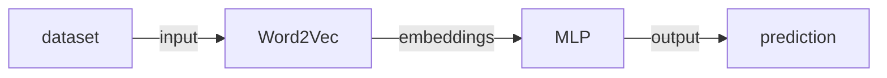

<center><h1>基于spark邮件自动分类</h1></center>

## 一、数据说明

数据集为英文语料集，一共包含20种类别的邮件，除了类别soc.religion.christian的邮件数为997以外每个类别的邮件数都是1000。每份邮件内部包含发送者，接受者，正文等信息。


## 二、实验方法

### 2.1 数据预处理

数据预处理阶段采用了几种方案进行测试

1. 直接将邮件内容按空格分词

2. 使用stanford corenlp进行分词，然后使用停词表过滤分词结果

3. 使用stanford corenlp进行分词，并根据词性和停词表过滤分词结果

综合上面三种方案，测试结果最好的是方案二的预处理方式。将所有的邮件预处理之后写入一个文件中，文件每行对应一封邮件，形式如"类别\t按空格分隔的邮件分词"

```
comp.os.ms-windows.misc    I search Ms-Windows logo picture start Windows
misc.forsale    ITEMS for SALEI offer item I reserve the right refuse offer Howard Miller
comp.sys.ibm.pc.hardware    I hd bad suggest inadequate power supply how wattage
```

### 2.2 pipeline建模

基于spark的pipeline构建端到端的分类模型

* 将数据预处理后得到的文件上传到hdfs上，spark从hdfs上读取文本数据并转换成DataFrame
* 为DataFrame的邮件类别列建立索引，然后将DataFrame作为Word2Vec的输入获取句子的向量表示

* 句子向量输入到含有2层隐藏层的多层感知机(MLP)中进行分类学习
* 将预测结果的索引列转换成可读的邮件类别标签




## 三、实验结果

将数据集随机划分成8:2，80%的数据作为训练集，20%的数据作为测试集。经过合理的调参，在测试集上的accuracy和F1 score可以达到90.5%左右，关键参数设置如下

```scala
 // Word2Vec超参
 final val W2V_MAX_ITER = 5  // Word2Vec迭代次数
 final val EMBEDDING_SIZE = 128  // 词向量长度
 final val MIN_COUNT = 1 // default: 5, 词汇表阈值即至少出现min_count次才放入词汇表中 
 final val WINDOW_SIZE = 5  // default: 5, 上下文窗口大小[-WINDOW_SIZE,WINDOW_SIZE]
 // MLP超参
 final val MLP_MAX_ITER = 300  // MLP迭代次数
 final val SEED = 1234L  // 随机数种子,初始化网络权重用
 final val HIDDEN1_SIZE = 64  // 第一层隐藏层节点数
 final val HIDDEN2_SIZE = 32  // 第二层隐藏层节点数
 final val LABEL_SIZE = 20  // 输出层节点数
```

邮件预测结果输出在hdfs上，文件内容每行的de左边是真实label，右边是预测label

<div align="center">
	
</div>


## 四、实验运行

### 4.1 环境要求

> hadoop-2.7.5
>
> spark-2.3.0
>
> stanford corenlp 3.9.2

### 4.2 源代码说明

Maven项目文件结构如下
<div align="center">
	
</div>

src/main/scala下为源代码，其中Segment.java和EnglishSegment.java用于英文分词，DataPreprocess.scala基于分词作数据预处理，MailClassifier.scala对应邮件分类模型。input下为数据集，output下为数据预处理结果MailCollection和预测结果prediction，target下为maven打好的jar包Mail.jar以及运行脚本submit.sh，pom.xml为maven配置。

### 4.3 运行方式

将数据集20_newsgroup放在input目录下，确保pom.xml中的依赖包都满足以后运行DataPreprocess得到预处理的结果MailCollection输出到output目录下。启动hadoop的hdfs，将MailCollection上传到hdfs上以便spark读取。然后启动spark，命令行下进入到target路径下运行./submit.sh提交任务，submit.sh内容如下

```shell
spark-submit --class MailClassifier --master spark://master:7077 --conf spark.driver.memory=10g --conf spark.executor.memory=4g --conf spark.executor.cores=2 --conf spark.kryoserializer.buffer=512m --conf spark.kryoserializer.buffer.max=1g Mail.jar input/MailCollection output
```

运行MailClassifier需要两个命令行参数，其中input/MailCollection为上传到hdfs上的路径名，output为预测结果输出到hdfs上的路径名，提交任务前确保输出路径在hdfs上不存在，否则程序会删除输出输出路径以确保程序正确运行。
